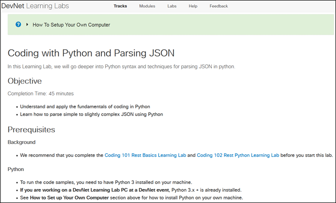
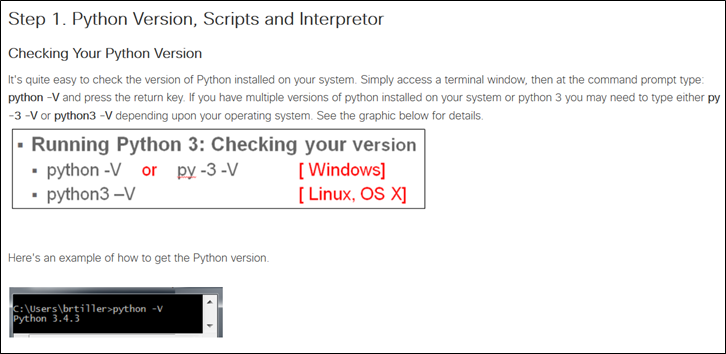
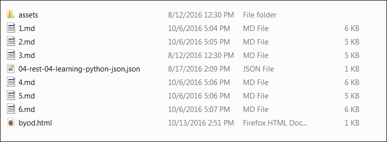
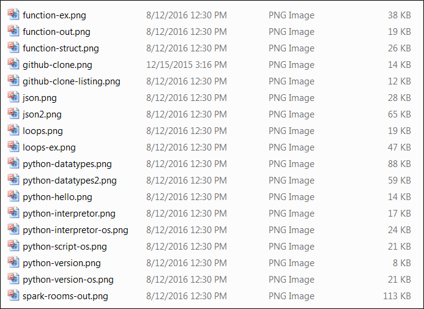
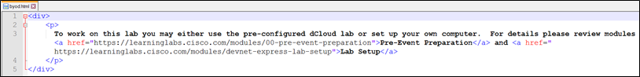
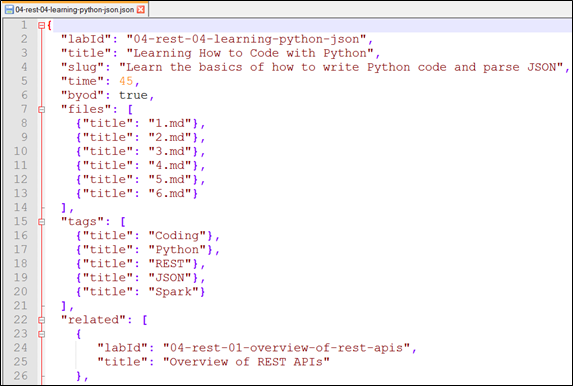
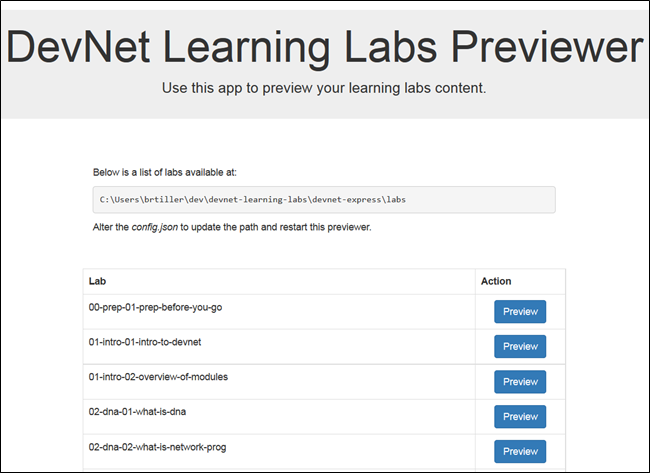

# Writing Learning Labs

This lab shows you how to create a DevNet Learning Lab.    

## Objectives

* Understand the structure of a DevNet Learning Lab
* Learn how to set up your working directory and its contents
* Understand basic Markdown syntax
* Understand how to provide byod.html content that tells users how to set up their own devices for use with your lab
* Understand how to use the JSON file to organize and present lab content
* Set up and use the Learning Lab Previewer Tool
* Begin writing your own Learning Lab

## Prerequisites

To write a DevNet Learning Lab, you'll need a basic understanding of `git` workflows. Optionally, you can [install a local git client](https://git-scm.com/book/en/v2/Getting-Started-Installing-Git), a repository browser (such as [Atlassian SourceTree](https://www.sourcetreeapp.com)) and a specialized markdown editor (such as [Atom](https://atom.io/)).

* **Basic Understanding of Git (Required)**

	If you are not already familiar with the [git](https://git-scm.com/) version-control system, see the [Git Learning Lab](https://learninglabs.cisco.com/lab/git-intro/step/1) or the [ProGit](https://progit.org/) book (free download or purchase paperback).

* **Local Git Client (Recommended)**

	Although the DevNet `git` repository provides a Web-based GUI, installing a `git` client on your own workstation will simplify the management of your repository-based content by allowing you to use the command line on your local workstation or a GUI client such as [Atlassian SourceTree](https://www.sourcetreeapp.com) to interact with the DevNet repository. For more information, see How to Set Up Your Own Computer.

* **Markdown Editor (Recommended)**

	You can write a DevNet Learning Lab entirely in the Web-based GUI to the DevNet repository or you can use any text editor that you prefer. However, a specialized Markdown editor can simplify the job. We recommend the [Atom text editor](https://atom.io/) because it provides syntax highlighting for Markdown, JSON and HTML, as well as an interactive Markdown previewer and other handy features.

## Step 1: Understanding the Structure of Learning Labs
To help users learn more easily, all Learning Labs provide a consistent structure and format. To make it easier for other DevNet members to contribute to Learning Lab projects, all files in the repository observe certain conventions for naming and placement.

### Objectives and Prerequisites
The first page of every learning lab begins with an __Objectives__ section, followed immediately by a __Prerequisites__ section. Create these sections according to the following guidelines.

  *  **Objective**

	The first line of this section specifies the estimated amount of time to complete the lab. Following this line, a bullet list enumerates each main skill that the user should possess, task that the user should complete, or idea that the user should understand upon completing the lab.

  * **Prerequisites**

	This section describes basic knowledge that the user should have prior to attempting to complete this lab. Whenever possible, provide links to relevant labs or other resources that may help the user to fulfill the prerequisites. This section may also list tools that the lab requires, but it should not provide setup instructions; those go in the byod.html file.

	<b>Figure: First page shows Objectives and Prerequisites</b>
	<br/><br/>
	
	<br/><br/>

### Content Files

Each page in the end-user navigable lab corresponds to a single markdown file in the repository; thus, this document may refer to an individual markdown file as a page.  To ensure a consistent experience for the end-user, each page observes the following conventions.

* **One main step per page**

	Each page provides only one main activity. This activity is formatted as a top-level headline of the form "Step *N*:*step_description*", in which *N* corresponds to the page number. For example, page 1 would contain Step 1, formatted as the largest headline; page 2 would contain Step 2, and so forth.  The page can contain additional subheads, but the largest headline must be of the form Step *N*: *step_description*.

	<b>Figure: One main step per page</b>
	<br/><br/>
	
	<br/><br/>

*  **Numeric filenames correspond to order of presentation**

	Each markdown file must have a numeric name that indicates its order in the end-user presentation of the lab.  For example, page 1 is named `1.md`, page 2 is named `2.md` and so on.

	<b>Figure: Numeric filenames</b>
	<br/> <br/>
	
	<br/><br/>  

* **Image files must meet the following specification**

	Your image files must meet the following specifications:
    * Images must be in PNG format and they must be 300 KB or less in size.  Larger image files take too long to encode, which slows production!
    * Under your lab directory, create an `assets/images` subdirectory and store images there.
    * **Image filenames must be all lowercase**.

	<b>Figure: Example of lab/assets/images directory</b>
	<br/> <br/>
	
	<br/><br/>  

* **Markdown syntax for adding an image to the page**

	To add an image to the page, use the following markdown syntax:
	```
	`
	```
	* `04-rest-04-learning-python-json` is the lab directory containing the `assets/images` subdirectory
	* `your_image.png` is the image file to place on the page.
	* The image will not be viewable in your markdown editor, but it will be visible in the **Learning Lab Previewer** tool. It will also be visible in the stage and production DevNet hosting environments.


* **The byod.html file: setup instructions for non-Cisco computers**

	Provide content for the "bring-your-own-device" file (`byod.html`), which tells users how to set up their own devices for use with the lab.  Later in this lab, we provide more details about creating your `byod.html` file.

	<b>Figure: The byod file</b>
    <br/> <br/>
	
	<br/><br/>

* **The JSON file**

	The name of this `.json` file is the directory in which the lab resides, plus the `.json` extension.  For example, if the directory is `04-rest-04-learning-python-json`, its .json file has the `04-rest-04-learning-python-json.json` filename.  Note that the naming scheme "04-rest-04" stands for "module 4 rest lab 4." Later in this Learning Lab, we will examine this naming convention in more detail.

	<b>Figure: The JSON file</b>
    <br/> <br/>
	
	<br/><br/>

## About the Learning Lab Previewer

The Learning Lab Previewer tool provides a way to preview the lab outside of the Production DevNet environment.  **All learning lab authors must preview their work with the Learning Lab Previewer tool and make corrections before requesting publishing.**

<b>Figure: Learning Lab Previewer tool output in browser</b>
<br/><br/>

<br/><br/>  

#### Next Step: Setting up Your Working Directory
