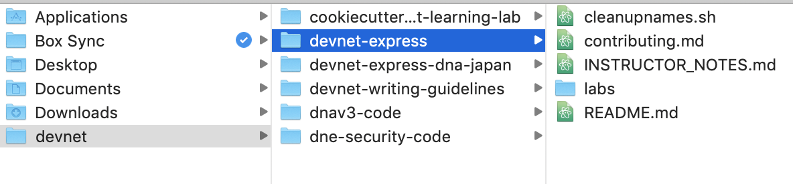
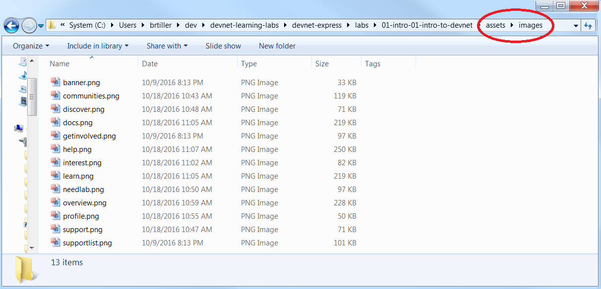

## Step 2: Setting up Your Working Directory and Fileset

### Creating the Working Directory
A Learning Lab consists of a specific set of file types arranged in a specific directory structure. DevNet uses GitLab to manage learning labs, so you'll most likely begin work on your lab by cloning an existing GitLab repository.

You can clone the repo into any location on your workstation that is convenient for you, such as in a subdirectory that you've created.  In the following figure, user `brubble` created a `dev\devnet-learning-labs` subdirectory in his local user directory and then cloned the `devnet-express` repository from Github into this directory.

<!-- these pics don't match the text very well. replace with better ones. -->
<b>Figure: Example of local user directory</b>
  

The top level of your local repo must contain a `labs/` folder that represents the same-named folder in the DevNet GitLab repo. Each learning lab that you create resides in its own folder under the `labs/` directory of your local repository.  The following image shows many learning labs as subdirectories of the `labs/` folder; for example, a lab named `01-intro-01-intro-to-devnet` appears near the top of the illustration. The address bar in the illustration shows that this folder and its siblings are children of the `labs/` folder. You can also see the use of a naming convention that DevNet staff uses: the `01-intro-01` stands for "module 1 intro lab 1" followed by a brief lab title.

<b>Figure: Individual labs as children of the labs/ folder in  local repo</b>
  

> **Note:** The **labs/** directory must be the parent directory of all labs in your repository&mdash;the publishing system searches for the **labs/** directory when attempting to publish labs to the production environment.

An individual learning lab resides in a directory that is an immediate child of the labs/ directory; in this example,  `01-intro-01-intro-to-devnet` is this directory, which we will call the "_your-learning-lab_ directory." Inside the _your-learning-lab_ directory, create a directory named __assets__; inside the __assets__ directory, create a directory named __images__.  As you create images for your learning lab, place the image files in the labs/_your-learning-lab_/assets/images directory. Note that images should be PNG format and 300 KB or less in size.

<b>Figure: Location of assets/images folder in  local repo</b>
  

### The Lab Files
Your lab is composed of four types of files:

* **Assets with Image files** in PNG format that reside in the assets/images directory. These image files should be less than 300 KB in size. Use kebab-case for file names and all lowercase.

* **One JSON file (.json)** describes the structure of the lab to the publication system and provides metadata such as a lab identification, title, tags and more. The JSON file must have the same name as your lab directory.  For example, in this lab the directory name is `01-intro-01-intro-to-devnet`, therefore the JSON file much be named `01-intro-01-intro-to-devnet.json`. More details to come.  

* **Markdown files (.md)** provide the main user-visible content of your lab, such as headlines, body text, images, and so on. Markdown files are written in markdown format, but they can also contain inline HTML. Each markdown file represents a single page and a single step in the lab; the names of these files should reflect this organization. that is,  Page 1 should be named 1.md; page 2 should be named 2.md and so on.  

* **One "bring your own device" file (byod.html)** provides configuration information for users who wish to configure their own computer for use your lab. It describes the programming language that the lab uses, along with any corresponding modules and other software that lab requires the user's workstation to provide, along with information about how to install these items.  

 
 
 

#### Next Step: Learn How to Use Markdown to Write Lab Content
