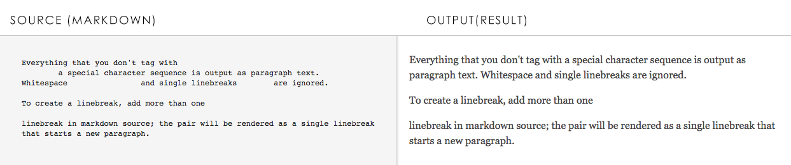

## Step 3. Writing Content in Markdown

[Markdown](https://en.wikipedia.org/wiki/Markdown) is a way to use plain text to create formatted output. Specialized character combinations in your source text tell the markdown formatter what sort of output to create: headlines, boldfaced text, italic text, hyperlinks and more. You'll use Markdown to write the page content for your Learning Lab.

For a guide to Markdown syntax, look at the [Mastering Markdown Guide](https://guides.github.com/features/mastering-markdown/) on GitHub. Please take a moment to review it. It covers almost everything that you might need to develop Learning Lab content.

### Markdown Examples
The following list shows examples of formatted output that you can create in Markdown. This list represents typical items that you might use to create a Learning Lab. The code listing that follows immediately after the list shows the corresponding Markdown syntax that created each example.

1. # Lab Title on Page One

2. ## Step 1.  For Step Headings and other headings, such as Objective and Prerequisites.

3. ### For Sub-Headings

4. #### For special sub-headings such as "Next Step: Learn this next" or "Congratulations you've completed this lab!"

5. No special markdown needed for regular text

6. *Italic Text*

7. **Bold text**

8. * Bullet points sometimes require indentation

    * To create a nested list, add a line break and indent four spaces

9. > Note: For special notes.

10. `Inline code font`

11. For links [link text](https://www.cisco.com)

12. For images  with a relative path.

13. Use `<br/><br/>` for additional line breaks.

14. Fence code blocks with three back-ticks before and after the listing; to activate language-specific syntax highlighting, add the name of the language after the first set of back-ticks.
``` python
var = "I'm learning Python!"
print (var)
```
15. Create expandable code blocks with the `<details>` element so that the user can expand to see examples in the web browser.

```
<details>
<summary> clickable header goes here </summary>
<pre><code>
code goes here
</code></pre>
</details>
```
<br/><br/>

#### Markdown Source for Examples

```markdown
1. # Lab Title on Page One

2. ## Step 1.  For Step Headings and other headings, such as Objective and Prerequisites.

3. ### For Sub-Headings

4. #### For special sub-headings such as "Next Step: Learn this next" or "Congratulations, you've completed this lab!"

5. No special markdown needed for regular text

6. *Italic Text*

7. **Bold text**

8. * Bullet points sometimes require indentation

    * To create a nested list, add a line break and indent four spaces

9. > Note: For special notes.

10. `Inline code font`

11. For links [link text](https://www.cisco.com)

12. For images  with a relative path.

13. Use `<br/><br/>` For additional line breaks.

14. Fence code blocks with three back-ticks before and after the listing; to activate language-specific syntax highlighting, add the name of the language after the first set of back-ticks.

\``` python
var = "I'm learning Python!"
print (var)
``` ```
15. Create expandable code blocks with the `<details>` element so that the user can expand to see examples in the web browser.

```
<details>
<summary> A clickable header goes here </summary>
Text that becomes visible only after clicking on the header goes here.
</details>
```
<!-- the escape shows up in output, but without it there are worse problems. -->
<br/><br/>

### Try it out: Online Interactive Markdown Editor

To experiment with markdown syntax, [click here to open an interactive online markdown editor](https://jbt.github.io/markdown-editor/#ZVDLTgMxDLznK+bGBe0PcOYPkDi7ibWJunWC7bD07+sVVZGKj57xPPz+zXr12mSFV3Jc+0Tp8uJwWrE3rwn3Idjg3GhDrqSUnRXGX5MlM5qhTx/TQYY0Al+VRoXzjy/pszZnGxTEpyEpsHDfGFsTPinT2R6ghvAqXbksKX105ICdI4nwjj+TJnfzV1ApuMTB0Sa2wik9dA/ehfRc+i6wPjXzW/A4lJpG123DiaEshcPxKEL/sv1+yZzU7TnHcgM=). You can type markdown syntax in the left-side pane and watch the preview change in the right-hand pane as you type.

<b>Figure: Online interactive markdown previewer</b>
<br/><br/>


### The Markdown Writing Workflow
Writing content in Markdown is an iterative process: you write your markdown source file (.md file) in a text editor, preview the output in some way, and then adjust your markdown source code as necessary to produce the expected results. Specialized markdown editors often provide an interactive preview that can speed this process; however, you cannot rely on this preview alone. There are many variations (or "flavors") of Markdown syntax, and not every previewer interprets every variation exactly alike.

To produce results that mimic the output of the DevNet publication toolchain closely, you must use the DevNet Learning Lab Previewer (LLP) tool to check your output. It's perfectly fine to use the previewer in your favorite markdown editor to create initial drafts of your content and then fine-tune according to the output that the LLP shows. However, you must use LLP to check your output before your lab can be published. Later in this lab, you'll install the LLP and try it out.     

#### Next Step: Learn About the byod.html File.
