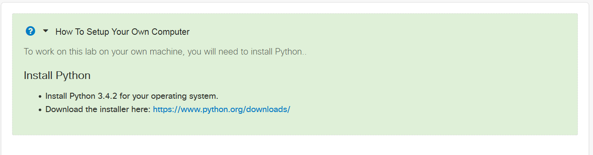

## Step 4. The byod.html File: Helping Users to Bring Their own Devices

DevNet places a "How to Setup Your Own Computer" link at the top of every page of your published Learning Lab. (You don't have to create this link yourself.)  When the user clicks this link, your `byod.html` file appears in the user's Web browser.

<b>Figure: Example output of byod.html</b>
<br/><br/>


The __BYOD__ in the `byod.html` file stands for __Bring Your Own Device__; the "device" is the user's own computer that they wish to use with a Learning Lab. Someone who wants to complete a lab on their own computer may need to install required software before starting certain labs. That is where the `byod.html` file comes into play: it describes required software, how to obtain it, and how to set it up.

Not all Learning Labs require the installation of additional software; for example, many labs can be completed in a  [DevNet Sandbox](https://developer.cisco.com/site/devnet/sandbox/) that provides everything the user needs. If your Learning Lab does not require the user to install software or perform other setup tasks on a BYOD, you do not need to provide a `byod.html` file.

### BYOD Example

The `byod.html` file is written in [HTML](http://www.w3schools.com/html/default.asp). The typical BYOD file uses just a handful of common HTML tags:

  * `<div> </div>` - Defines a division or a section in an HTML document and is used to group block-elements to format them with CSS. Your `byod.html` always starts and ends with this element.
  * `<h3> </h3>` - Indicates the heading size. Lower numbers create bigger headlines. H1 (a "first-level" headline) is the largest headline.
  * `<p> </p>` - Defines a paragraph.
  * `<ul> </ul>` - Creates a bulleted list.
  * `<ol> </ol>` - Creates a numbered list.
  * `<li> </li>` - Creates an item in the list.
  * `<a href="URL">HYPERLINK TEXT</a>` - Creates a hyperlink.

>**Note:** The `byod.html` file always starts and ends with `<div> </div>` tags. If you are not familiar with HTML tags, refer to [this HTML Reference website](http://www.w3schools.com/tags/default.asp).

The following code listing shows the HTML for the BYOD file that appears in the figure at the top of this page. Notice that the question-mark icon and "How to Setup Your Own Computer" headline are not in this file - the DevNet site supplies those items for you.

```html
<div>
<p> To work on this lab on your own machine, you will need to install Python.</p>
<h3>Install Python</h3>
	<ul>
		<li>Install Python 3.4.2 for your operating system.</li>
		<li>Download the installer here: <a=href"https://www.python.org/downloads/">https://www.python.org/downloads/</a></li>
	</ul>
</div>
```
<br/>

### Creating your byod.html file

1. Create a file named `byod.html` at the lab/_your-learning-lab_/ location in your working directory.  
1. Use your own text editor to add a `<div></div>` element to the beginning and the end of your `byod.html` file.
1. Add the following information between the `<div>` and `</div>` tags:

  * Software that your Learning Lab expects the BYOD to provide (languages, tools, browser version, and so on), along with information about how to obtain it and how to install it.
  This information need not be complex&mdash;less is more! For each required package or configuration, a simple bullet list item that provides a link to an online installer and installation instructions is sufficient. If you do provide installation instructions, keep them brief. When appropriate, include information for multiple BYOD platforms, such as Windows, Mac or Linux.
  * Any other configuration that the user must create, such as reserving a DevNet sandbox.
  * Prerequisite skills or knowledge
1. As you edit the `byod.html`, preview it in a supported HTML editor or Web browser.
1. When you are satisfied with the contents of your `byod.html` file, save changes and close the file.


#### Next Step: Using the JSON file to tie Everything Together
