## Step 8. Installing and Running the Learning Lab Previewer Tool in Docker

Markdown previewers vary in their rendering capabilities as well as in their interpretations of various flavors of Markdown. To preview your lab content, run a Docker container with a previewer tool.

To run the previewer within a Docker container with Ubuntu as the operating system in a Virtual Box virtual machine, follow these instructions.

> **Note:** Although it is possible to install Docker on the Windows operating system (OS), certain requirements (must be Pro or higher version) and bugs may prevent the previewer from working properly. As a workaround, we recommend that Windows users install Docker Container on a [Ubuntu 16.04 LTS](https://www.ubuntu.com/download/server) virtual machine that runs on [Virtual Box](https://www.virtualbox.org/wiki/Downloads).

DevNet has created a Dockerfile that containerizes the previewer. For instructions on how to install the previewer on a Unix-based operating system, see the [BitBucket Repository](https://bitbucket-eng-sjc1.cisco.com/bitbucket/projects/DLL/repos/learning-labs-previewer/browse/README.md).

>**Note:** To access the Docker image stored on containers.cisco.com, you must be on a Cisco trusted network or you must establish a VPN connection to the Cisco network.

To use the previewer in a Docker container that runs on an Ubuntu virtual machine, take the following steps:

1. Download the [Ubuntu Desktop ISO image](https://www.ubuntu.com/download).
    Be sure that you choose a "desktop" version, which provides the GNOME GUI and support for Web browsers that run in GNOME.
1. Download and install [VirtualBox](https://www.virtualbox.org/wiki/Downloads) onto your workstation.
1. Download the VirtualBox Guest Additions for Ubuntu to your workstation for later use.

2. Use Virtual Box to create a new virtual machine (VM):
    * In the __Oracle VM VirtualBox Manager__ window, click __New__.
	* __Name and operating system__&ndash;Enter a name for your VM, choose __Linux__ as the __Type__ and choose __Ubuntu (64-bit)__ as the __Version__.  
	* __Memory Size__&ndash;Allocate at least 1 GB of RAM
    * __Hard Disk__&ndash;Choose __Create a Virtual Hard Disk Now__.
    * __Hard Disk File Type__&ndash;Choose __VDI (VirtualBox Disk Image)__.
    * __Storage on Physical Hard Disk__&ndash;Choose __Dynamically Allocated__.
    * __File Location and Size__&ndash;Allocate at least 11 GB storage to the virtual hard disk.
    * Click __Create__.
        The new VM appears in the column on the left side of the __VirtualBox Manager__.
<br/><br/>

1. Attach the Ubuntu ISO and configure other VM settings; to do so, right-click the new VM in the left column of __VirtualBox Manager__ and choose __Settings...__
    * On the __System__ tab, deselect __Floppy__.
    * On the __Storage__ tab, select __Empty__ under __Controller:IDE__ then click the optical disk icon.

        <b>Figure: Choosing the optical disk file</b>
        <br/><br/>
        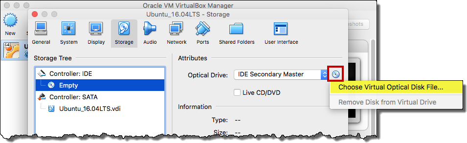
    * Select __Choose Virtual Optical Disk file...__, select the Ubuntu ISO, and click __Open__.
    * On the Network tab choose Bridged Adapter.
    * Click OK.
<br/><br/>

1. Install Ubuntu into the VM
    1. Select your new VM in __Virtual Box Manager__ and click __Start__.  

        <b>Figure: Running the VM</b>
        <br/><br/>
        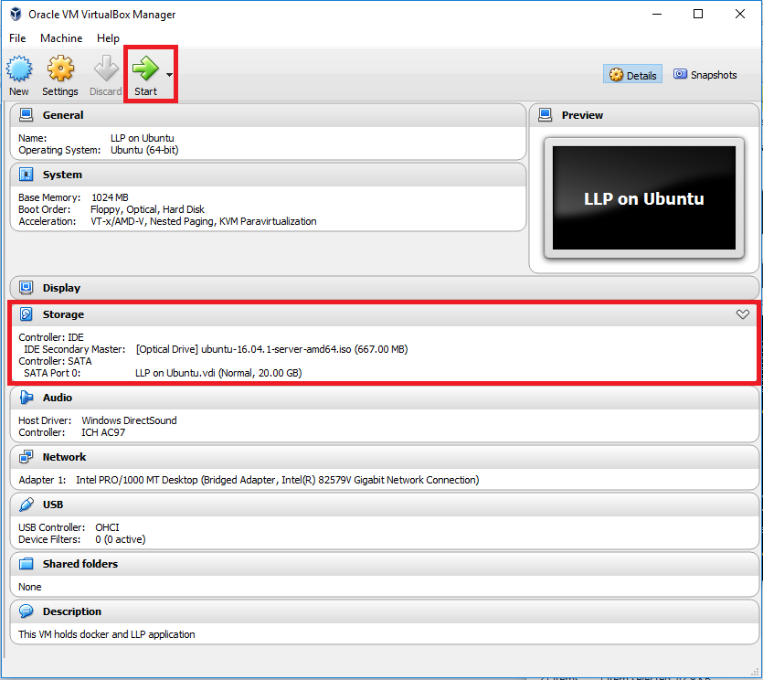

    <!-- maybe you don't have to choose the iso while setting up the vm? -->
    <!-- * At the OS prompt select the Ubuntu ISO image. -->

    1. Click __Install Ubuntu__ to install Ubuntu from the ISO onto the VM's virtual hard disk.
        * Deselect __Download updates__ and deselect __install third party software__ before clicking __Continue__.
        * Select __Erase disk and install ubuntu__. In this context, this option refers to the virtual disk; it won't erase the hard disk of the host machine!
        * Respond to the install prompts using default values except when the default value will not allow you to proceed further.
            When an operation is destructive,  the Ubuntu installer makes you choose it intentionally. For example, you must intentionally choose the option that actually installs the OS, overwriting whatever might be on the target disk.

    Optionally, see [this page](https://www.ubuntu.com/download/desktop/install-ubuntu-desktop) for more information about installing Ubuntu.

4. Add the lab directory that contain your labs as a shared folder that the VM can access.

    1. In VirtualBox, choose __Settings...>Shared Folders__.

        <b>Figure: Shared Folders setting in VirtualBox Manager</b>
        <br/><br/>
        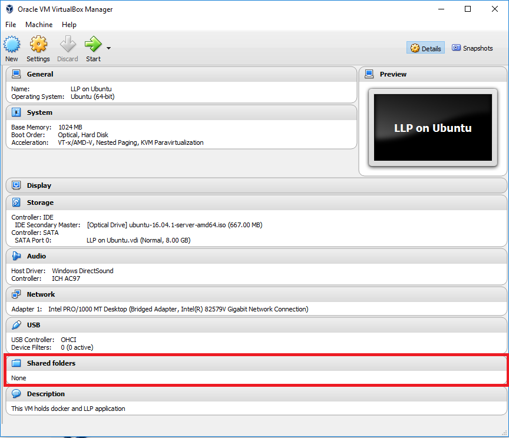

	1. Click the **Add new shared folder** icon.

        <b>Figure: Adding a new shared folder</b>
        <br/><br/>
        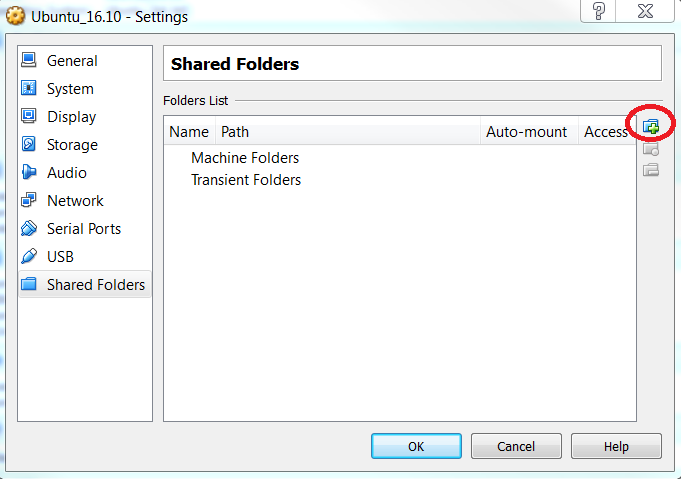
        <br/>
    1. Click the down-arrow icon next to **Folder Path** and select __Other__.
    2. Navigate to the PARENT of the **labs** folder in your local repository and click __Open__
    <!-- Does this need to go to the PARENT of labs ? so that labs is visible to the publishing system ? -->
    3. Optionally, enter a different name for your shared folder by typing it into the the **Folder Name** field.
     **Note:** Virtual Box prefixes **sf_** to the name that you enter in the **Folder Name** field. For example, if you create a shared folder named MyFolder, it appears in the Ubuntu VM as /media/sf_MyFolder.
    1. Select the __Auto Mount__ and __Make Permanent__ checkboxes, then click __OK__.  
     **Note:** on some Virtual Box platforms, you may need to click __OK__ in two dialog boxes.

        <b>Figure: Auto Mount and Make Permanent options</b>
        <br/><br/>
        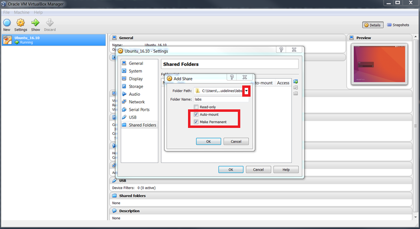
        <br/>
6. In order for your VM to access the shared folder, you need to install the VirtualBox guest additions:
<!-- I had problems with shared folders; still troubleshooting. May be better to skip this and use the CLI instructions -->
    * In Virtual Box, choose __Devices>Insert Guest Additions CD image...__.  

        <b>Figure: Mounting the Guest Additions CD image</b>
        <br/><br/>
        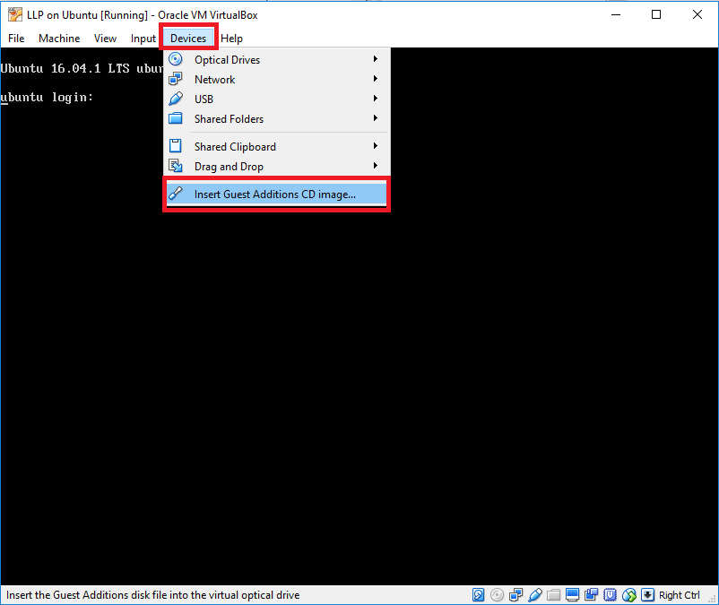
    * At the prompt, confirm your intention to install the VirtualBox guest additions and supply your password.
    * If, instead of an installation prompt, an error message says that the __GuestAdditions.iso__ cannot be mounted, take the following steps:
        1. Shut down your virtual machine.
        1. In __Virtual Box Manager__, select the VM, then choose __Machine>Settings...__
        1. On the __Storage__ tab, select __VBoxGuestAdditions.iso__ under __Controller:IDE__ then click the optical disk icon.
        1. Choose the ISO that you used to install Ubuntu; for example, __ubuntu-16.04.1-server-amd64.iso__.
        1. Click the optical disk icon again and choose __Remove Disk From Virtual Drive__.
        1. Click OK, start the VM and log in.
        1. Choose __Devices>Insert Guest Additions CD image...__.
            This time around, you should see the prompt to install guest additions. The cryptic error message you saw earlier was complaining that the Ubuntu installation virtual disc was still in your virtual drive, preventing you from putting the Guest Additions installation disc into that same drive, just as if you had left a physical disc in a physical drive.

7. Restart your VM, open a terminal window, and issue the `sudo apt update` command.

    <b>Figure: Installing updates</b>
    <br/><br/>
    

8. After the update completes, issue the following command to install all necessary dependencies:

    `sudo apt install -y dkms build-essential linux-headers-generic linux-headers-$(uname -r)`

    <b>Figure: Installing dependencies</b>
    <br/><br/>
    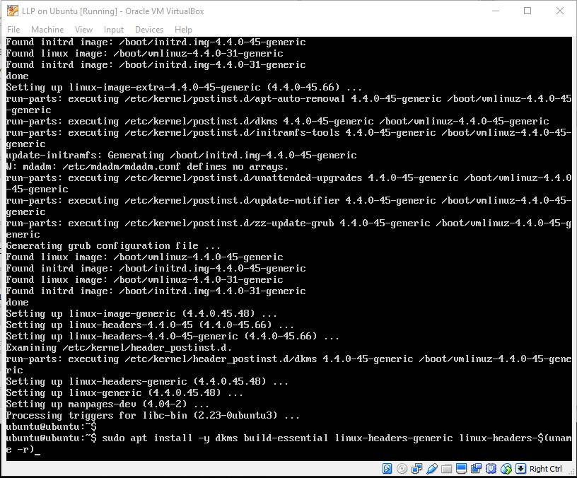

9. Finally, issue the following command to make everything you just installed ready for use.

    `sudo mount /dev/sr0/ /media/cdrom/; sudo /media/cdrom/VBoxLinuxAdditions.run; sudo reboot`

    <b>Figure: Mounting the shared disk and rebooting the VM</b>
    <br/><br/>
    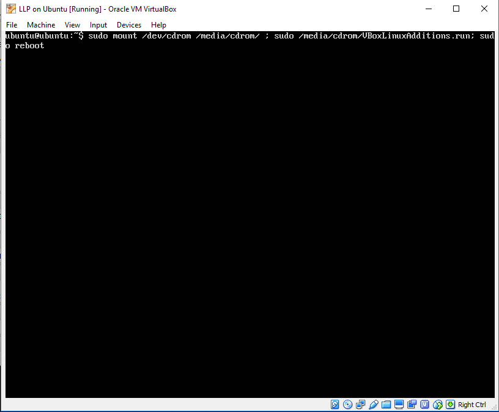

10. When the machine comes back online, authenticate and issue the `ls /media/sf_*` command. It should display the contents of your working directory in the  VM.  
<!-- I recall a lot of screwing around to get this to work. Had to add a command to .bash_profile or something. That was actually on a
different Ubuntu VM, but if the step is missing, or if sharing does not work upon rebooting the VM, look in a previous ubuntu
LL setup file for that step. e.g. it might be in 7.md in this lab // jp -->

    <b>Figure: Verifying the contents of the shared folder</b>
    <br/><br/>
    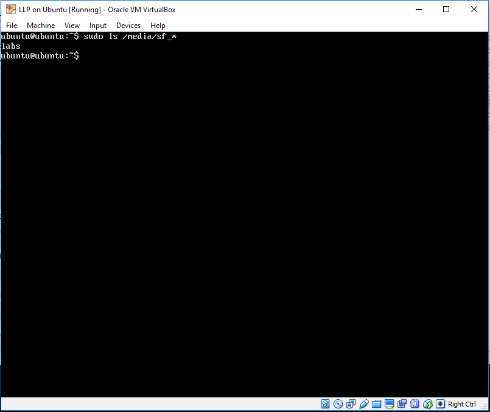

    * If the `labs` folder does not appear in this listing, correct your shared folder settings.
    * If you cannot access the shared content, take the following steps:
        1. Add your username to the `vboxsf` group:
            `sudo adduser `_yourusername_` vboxsf`
        1. Reboot the VM.
        1. Recheck your access to the shared folder by issuing `ls /media/sf_*`  or by using your graphical desktop environment to look inside the `Computer/Media/sf_labs` folder.
<br/><br/>
<!-- at this point can we unmount the VBOXADDITIONS cd-rom? otherwise it always gets mounted (from my shared mac folder) -->

11. Before attempting to install Docker, update the `apt` source list by issuing the following command in the terminal window:

    `$ sudo apt install -y apt-transport-https ca-certificates`

    <b>Figure: Updating the `apt` source list</b>
    <br/><br/>
    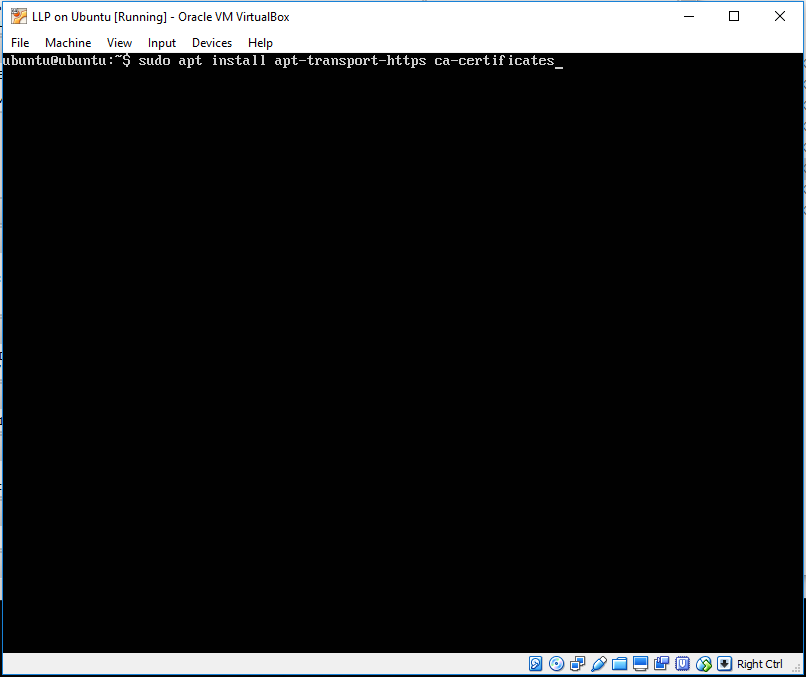

12. To add a new GNU Privacy Guard (GPG) key, issue the following command in the terminal window:

   `sudo apt-key adv --keyserver hkp://p80.pool.sks-keyservers.net:80 --recv-keys 58118E89F3A912897C070ADBF76221572C52609D`

    <b>Figure: Adding a GNU Privacy Guard key</b>
    <br/><br/>
    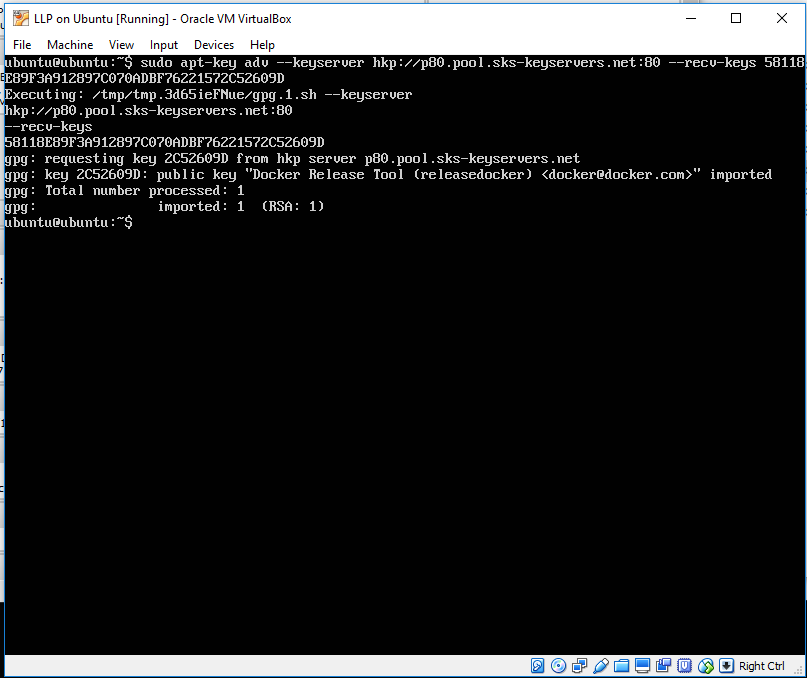

13. To add a new repository for `apt` search, issue the following command in your terminal window:

    `echo "deb https://apt.dockerproject.org/repo ubuntu-xenial main" | sudo tee /etc/apt/sources.list.d/docker.list`

    <b>Figure: Adding a new repository for `apt` search</b>
    <br/><br/>
    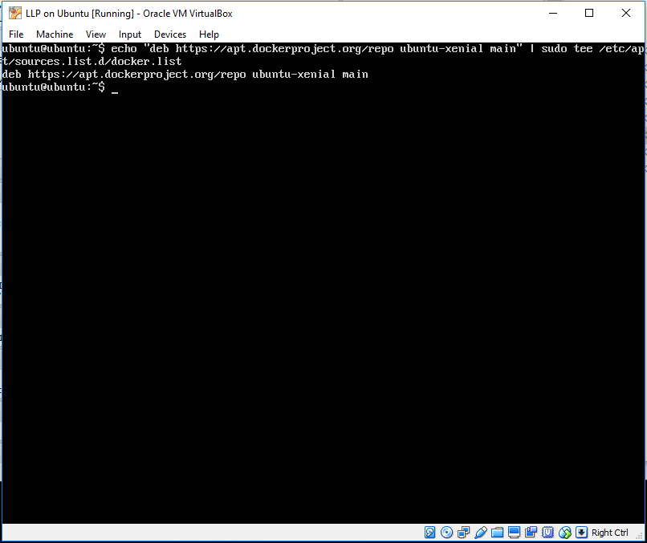

14. Now, you are ready to install Docker; to do so, issue the following command in your terminal window:

    `sudo apt update ; sudo apt install -y linux-image-extra-$(uname -r) linux-image-extra-virtual docker-engine; sudo service docker start`

    <b>Figure: Installing Docker</b>
    <br/><br/>
    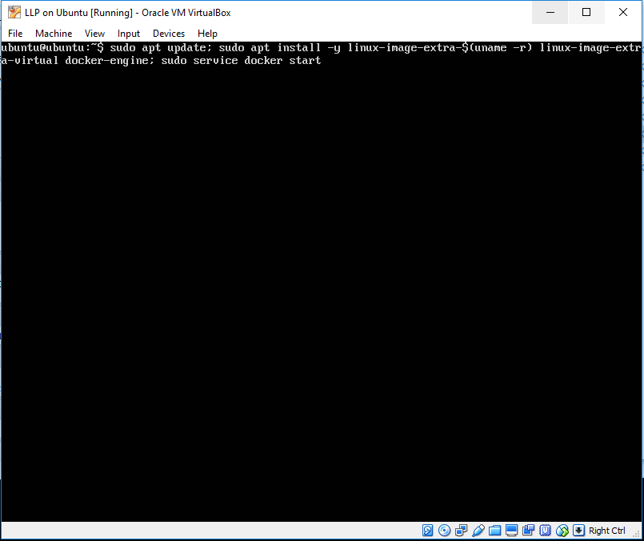

15. After the installation process completes, run:

```docker run -p "9000:9000" -p "35729:35729" -v "{full path to labs directory}/labs:/opt/labs" containers.cisco.com/asroach/learning-labs-previewer:latest
```

To stop the container runtime, type ctrl-C.

19. To access the previewer, you need the IP address of the ubuntu VM. Issue `ifconfig` command and note the inet addr value associated with the physical Ethernet interface. For example, in the following figure, this interface is `enp0s3` and `192.168.0.16` is its IP address.

  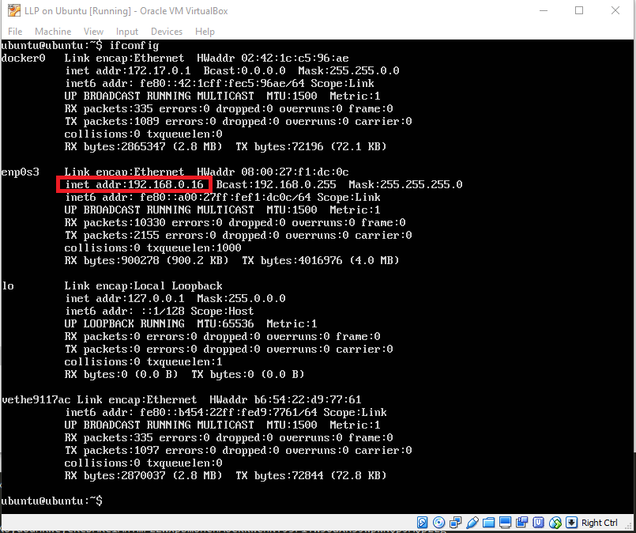

20. On the machine that hosts Docker (for example, your Windows machine, or the Ubuntu VM into which you installed Docker), use your preferred Web browser to view port 9000 at the IP address you identified in the previous step. For example, in the following figure, the URL to browse is `http://192.168.0.16:9000`. If everything is working correctly, you should see the **Learning Labs Previewer** web page; under the **lab** column, you will find the lab that you created during this tutorial. Click **Preview** to view a rendition of this content.

  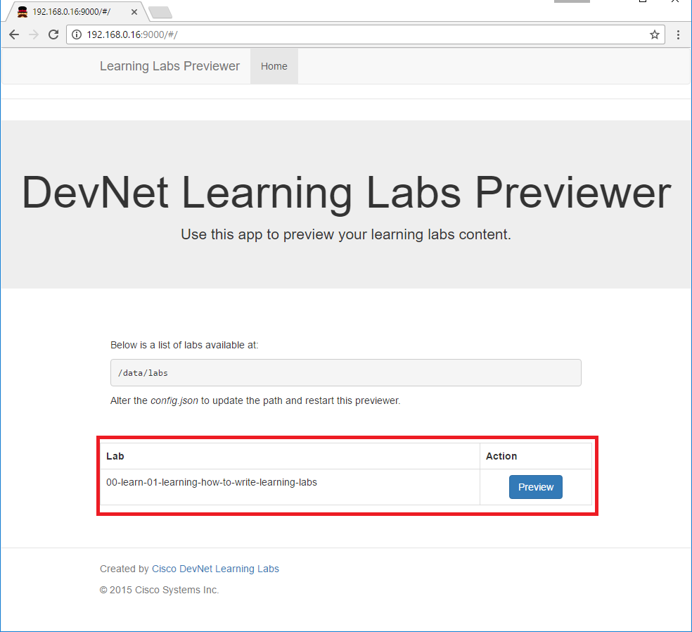

21. Click the **Preview** button to display the `1.md` file. Verify that everything works and check next pages if you have them. The most important thing to look for is missing images. As you can see the page is broken up into two sections; the upper section shows converted markdown file and the lower section shows original code. This feature helps you to find and identify the issue in the code right away.
>**Note:** If you received an error after click **Preview** button it means there is a syntax error in the `.json` file. The error should point where the problem is.

  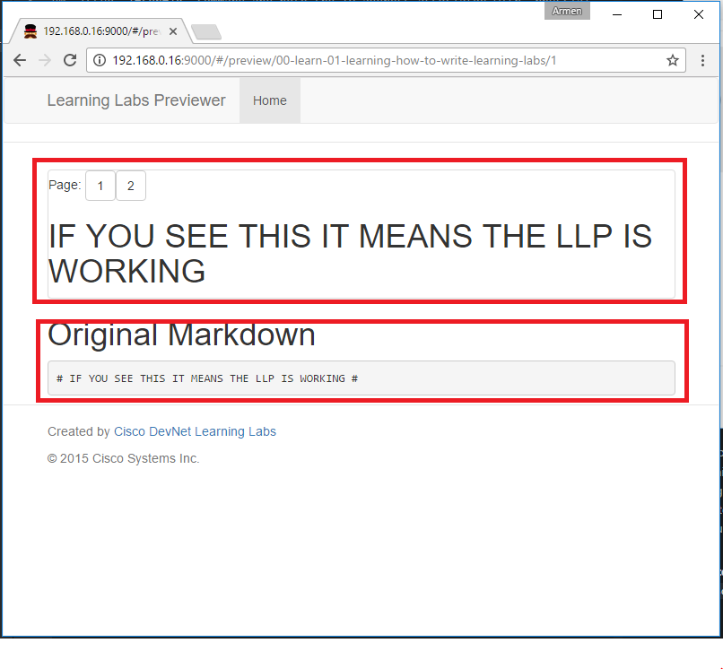

#### Next Step: Take the Next Step Toward Writing Learning Labs
